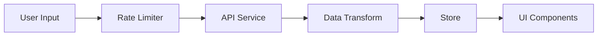

# Weather Forecast App 🌤️

A modern weather application built with Next.js, TypeScript, and React, providing real-time weather data and forecasts.

## 🚀 Features

- **Location-based Weather**: Automatic detection using geolocation
- **Search Functionality**: City and ZIP code search with autocomplete
- **Detailed Weather Info**: Current conditions and 5-day forecast
- **Responsive Design**: Mobile-first approach with dark/light mode
- **Offline Support**: Graceful degradation when offline
- **Rate Limiting**: Smart API usage management
- **User Preferences**: Temperature unit selection

## 🏗️ Technical Architecture

### Component Structure
```typescript
src/
  ├── app/
  │   ├── components/          # Reusable UI components
  │   │   ├── AutoCompleteSearch
  │   │   ├── CurrentWeather
  │   │   ├── Forecast
  │   │   └── OfflineFallback
  │   ├── store/              # State management
  │   ├── services/          # API integrations
  │   └── utils/             # Helper functions
```

### State Management (Zustand)
```typescript
interface WeatherState {
  currentWeather: CurrentWeather | null;
  forecast: Forecast | null;
  loading: boolean;
  error: string | null;
  unit: TemperatureUnit;
  favoriteLocations: string[];
}
```

### Data Flow


## 🛠️ Setup & Installation

1. **Clone & Install**
```bash
git clone https://github.com/yourusername/weather-forecast-app.git
cd weather-forecast-app
npm install
```

2. **Environment Setup**
```plaintext
NEXT_PUBLIC_WEATHER_API_KEY=your_api_key
NEXT_PUBLIC_IPAPI_KEY=your_ipapi_key
```

3. **Development**
```bash
npm run dev
```

## 🧪 Testing

### Running Tests
```bash
npm test                # Run all tests
npm run test:watch     # Watch mode
npm run test:coverage  # Coverage report
```

### Test Structure
```typescript
src/
  ├── __tests__/
  │   ├── components/
  │   ├── store/
  │   └── utils/
```

## 📝 Design Decisions

### 1. State Management
- **Zustand**: Chosen for simplicity and performance
- **Local Storage**: Persistence for user preferences
- **Rate Limiting**: Custom implementation for API calls

### 2. Component Architecture
- **Atomic Design**: Building blocks approach
- **Lazy Loading**: Performance optimization
- **Error Boundaries**: Graceful error handling

### 3. Data Handling
- **TypeScript**: Strong typing for maintainability
- **Data Transform Layer**: Clean data processing
- **Caching Strategy**: Optimal data freshness

## 🚀 Deployment

### Vercel Deployment via GitHub

1. **Repository Setup**
   - Push your code to GitHub repository
   - Ensure all environment variables are properly set in `.env.local`

2. **Vercel Deployment Steps**
   - Visit [Vercel Dashboard](https://vercel.com/dashboard)
   - Click "Add New Project"
   - Import your GitHub repository
   - Configure project settings:
     ```plaintext
     Framework Preset: Next.js
     Root Directory: ./
     Build Command: npm run build
     Output Directory: .next
     ```

3. **Environment Variables**
   Add the following in Vercel project settings:
   ```plaintext
   NEXT_PUBLIC_WEATHER_API_KEY=your_api_key
   NEXT_PUBLIC_IPAPI_KEY=your_ipapi_key
   ```

4. **Deployment Settings**
   ```plaintext
   Production Branch: main
   Framework: Next.js
   Node.js Version: 18.x
   ```

5. **Deployment URLs**
   - Production: [weather-forecast-app](https://weather-forecast-app-dharanesshmds-projects.vercel.app/)
   - Preview: Generated for each PR

### Automatic Deployments

- Every push to `main` triggers production deployment
- Pull requests create preview deployments
- Branch deployments available for testing

### Monitoring

- View deployment status in Vercel Dashboard
- Check build logs for errors
- Monitor performance analytics
- Set up status alerts

### Custom Domain (Optional)

1. Add your domain in Vercel Dashboard
2. Configure DNS settings:
   ```plaintext
   Type: A
   Name: @
   Value: 76.76.21.21
   ```

### Troubleshooting

If build fails, check:
- Build logs in Vercel Dashboard
- Environment variables are set
- Dependencies are properly listed in `package.json`
- Node.js version compatibility

### Development Workflow

```bash
# Local development
npm run dev

# Test production build locally
npm run build
npm start

# Push changes
git push origin main  # Triggers automatic deployment

## 🤝 Contributing

1. Fork the repository
2. Create feature branch (`git checkout -b feature/AmazingFeature`)
3. Commit changes (`git commit -m 'Add AmazingFeature'`)
4. Push to branch (`git push origin feature/AmazingFeature`)
5. Open pull request


Made with ❤️ by Dharanessh M D
