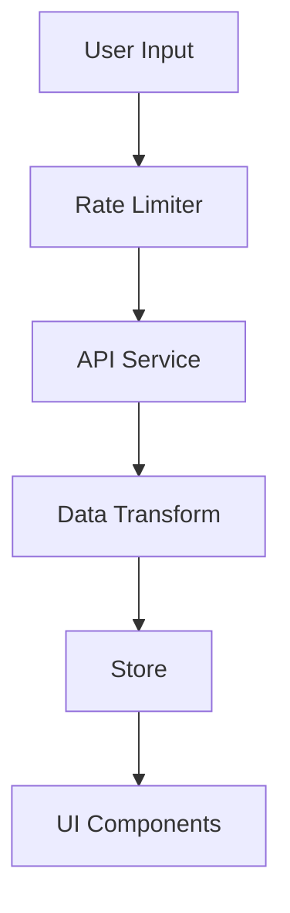

# Logic Implementation Documentation

## Data Flow Architecture



## Business Logic Implementation

### 1. Rate Limiting

```typescript
// Example of Rate Limiter implementation
export class RateLimiter {
  private requests: number = 0;
  private resetTime: number;

  constructor(
    private maxRequests: number,
    private timeWindow: number
  ) {
    this.resetTime = Date.now() + timeWindow;
  }

  async checkLimit(): Promise<boolean> {
    if (Date.now() > this.resetTime) {
      this.requests = 0;
      this.resetTime = Date.now() + this.timeWindow;
    }
    
    if (this.requests >= this.maxRequests) {
      return false;
    }
    
    this.requests++;
    return true;
  }
}
```

### 2. Data Transformation

```typescript
// Example of data transformation layer
interface WeatherResponse {
  main: {
    temp: number;
    feels_like: number;
    humidity: number;
  };
  weather: Array<{
    main: string;
    description: string;
    icon: string;
  }>;
}

interface TransformedWeather {
  temperature: number;
  feelsLike: number;
  humidity: number;
  condition: string;
  description: string;
  icon: string;
}

const transformWeatherData = (data: WeatherResponse): TransformedWeather => ({
  temperature: Math.round(data.main.temp),
  feelsLike: Math.round(data.main.feels_like),
  humidity: data.main.humidity,
  condition: data.weather[0].main,
  description: data.weather[0].description,
  icon: data.weather[0].icon
});
```